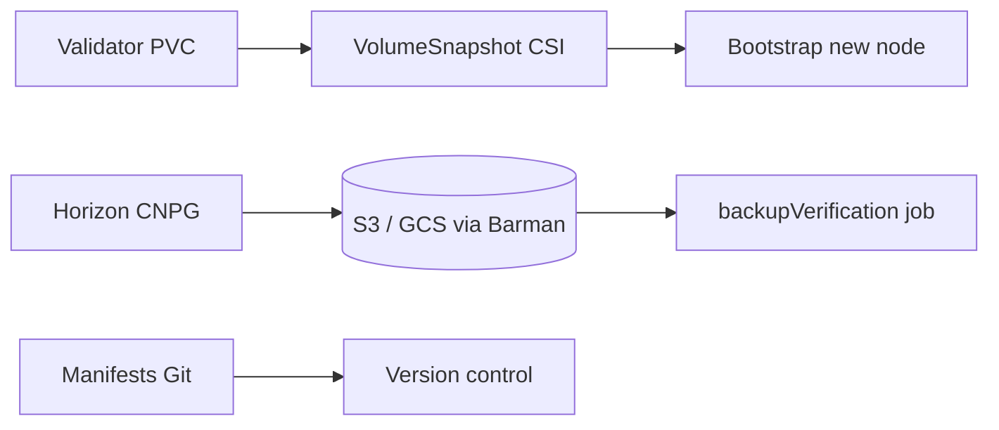

# Backup and Disaster Recovery Runbook

End-to-end **backup, restore, and disaster recovery** procedures for Stellar-K8s: what to protect, schedules defined in the repository, verification, restoration steps, and operator checklists.

**Related:** [Backup verification](backup-verification.md) · [Volume snapshots](volume-snapshots.md) · [DR failover](dr-failover.md) · [Forensic snapshots](forensic-snapshot.md) · [Multi-cluster guide](multi-cluster.md) · [Operations index](operations/index.md)

---

## Navigation

| Section | Topic |
|---------|--------|
| [1. Scope and objectives](#1-scope-and-objectives) | What this runbook covers |
| [2. What must be backed up](#2-what-must-be-backed-up) | Data classes |
| [3. Backup mechanisms](#3-backup-mechanisms) | CSI, DB, Velero, archives |
| [4. Schedules and retention](#4-schedules-and-retention) | CRD-defined values |
| [5. Backup verification](#5-backup-verification) | Automated restore tests |
| [6. Restore procedures](#6-restore-procedures) | Step-by-step |
| [7. Disaster scenarios](#7-disaster-scenarios) | Playbooks |
| [8. Operational checklists](#8-operational-checklists) | Pre/during/post |
| [9. References](#9-references) | Manifests and code |

---

## 1. Scope and objectives

This runbook applies to Stellar-K8s managed resources:

- **Validator** ledger PVCs (Stellar Core data)
- **Horizon** PostgreSQL (managed or external)
- **Kubernetes object state** (CRDs, Secrets metadata, ConfigMaps)
- **Optional** forensic bundles and history archives

RPO/RTO targets in [deployment-patterns/multi-region-dr.md](deployment-patterns/multi-region-dr.md) are **design targets** for multi-region patterns (for example Velero RPO tied to schedule). Adjust for your environment; values not set in your manifests are **configuration points**, not guarantees.

---

## 2. What must be backed up

| Asset | Why | Primary mechanism |
|-------|-----|-------------------|
| Validator data PVC | Ledger + SCP state | `spec.snapshotSchedule` → VolumeSnapshot |
| Horizon PostgreSQL | API query data | `spec.managedDatabase.backup` (Barman → object storage) |
| Validator seed / DB secrets | Recovery identity | Kubernetes Secrets + external KMS ([secret-management-kms.md](secret-management-kms.md)) |
| `StellarNode` manifests | Desired state | GitOps repo |
| etcd / cluster state | Control plane DR | Cluster provider backup (out of operator scope) |
| History archives | Catch-up / audit | S3/GCS archives + [archive-pruning.md](archive-pruning.md) |



---

## 3. Backup mechanisms

### 3.1 CSI volume snapshots (validators)

Documented in [volume-snapshots.md](volume-snapshots.md). Validator-only.

**On-demand snapshot:**

```bash
kubectl annotate stellarnode my-validator \
  stellar.org/request-snapshot=true -n stellar-nodes --overwrite
```

**Scheduled snapshot (CRD excerpt):**

```yaml
spec:
  nodeType: Validator
  snapshotSchedule:
    schedule: "0 2 * * *"
    retentionCount: 7
    flushBeforeSnapshot: false
```

Samples: [`config/samples/snapshot-bootstrap-csi.yaml`](../config/samples/snapshot-bootstrap-csi.yaml).

### 3.2 Managed database backup (Horizon)

CloudNativePG backup via `spec.managedDatabase.backup`:

```yaml
spec:
  managedDatabase:
    enabled: true
    backup:
      enabled: true
      destinationPath: "s3://stellar-backups/horizon"
      credentialsSecretRef: aws-backup-credentials
      retentionPolicy: 30d
```

See [`config/crd/stellarnode-crd.yaml`](../config/crd/stellarnode-crd.yaml) (`managedDatabase.backup`).

### 3.3 Velero (cluster-level)

Example schedule from [deployment-patterns/multi-region-dr.md](deployment-patterns/multi-region-dr.md):

```yaml
apiVersion: velero.io/v1
kind: Schedule
metadata:
  name: stellar-nightly
  namespace: velero
spec:
  schedule: "0 2 * * *"
  template:
    includedNamespaces:
      - stellar-validator
      - stellar-rpc
    ttl: 720h
    snapshotVolumes: true
```

Restore:

```bash
velero restore create --from-backup stellar-nightly-2026-06-27
velero restore describe stellar-nightly-2026-06-27 --details
```

### 3.4 Compressed DB bootstrap archives

Validators can bootstrap from `spec.bootstrap.backupUrl` (`s3://` or `https://`) per CRD — useful for DR copies of database archives.

### 3.5 Forensic snapshots (incident-driven)

Not a substitute for scheduled backup; captures PCAP/core dumps on annotation:

```bash
kubectl annotate stellarnode prod-validator \
  stellar.org/request-forensic-snapshot=true --overwrite
```

See [forensic-snapshot.md](forensic-snapshot.md).

---

## 4. Schedules and retention

| Mechanism | Example schedule | Retention in repo defaults |
|-----------|------------------|---------------------------|
| VolumeSnapshot | `0 2 * * *` (daily 02:00 UTC) | `retentionCount: 7` in examples |
| managedDatabase.backup | Configure per cluster | `retentionPolicy: 30d` in CRD default |
| Velero Schedule | `0 2 * * *` | `ttl: 720h` in pattern doc |
| backupVerification | `0 2 * * 0` (weekly) | Example in [`examples/backup-verification-example.yaml`](../examples/backup-verification-example.yaml) |

If a field is absent in your manifest, define it explicitly before assuming a schedule exists.

---

## 5. Backup verification

Automated verification restores backups into temporary namespaces and runs integrity checks ([backup-verification.md](backup-verification.md)).

```yaml
spec:
  backupVerification:
    enabled: true
    schedule: "0 2 * * 0"
    backupSource:
      type: s3
      bucket: stellar-backups
      prefix: horizon-testnet/
      credentialsSecret: aws-credentials
    strategy: standard
```

Full example: [`examples/backup-verification-example.yaml`](../examples/backup-verification-example.yaml).

**Verify reports** (when S3 report storage configured):

```bash
aws s3 ls s3://stellar-reports/verification-reports/ --recursive | tail -5
```

---

## 6. Restore procedures

### 6.1 Restore validator from VolumeSnapshot

1. Confirm snapshot is `Ready`:

   ```bash
   kubectl get volumesnapshot -n stellar-nodes
   ```

2. Create new `StellarNode` with `restoreFromSnapshot` ([volume-snapshots.md](volume-snapshots.md)):

   ```yaml
   spec:
     restoreFromSnapshot:
       name: snap-validator-primary-20260727
       namespace: stellar-nodes
   ```

3. Wait for Ready:

   ```bash
   kubectl wait stellarnode validator-restored -n stellar-nodes \
     --for=condition=Ready --timeout=600s
   ```

4. Validate Core `/info` and SCP participation before advertising peers.

### 6.2 Restore Horizon database

1. Restore Barman backup to a new CNPG cluster per your storage provider runbook.
2. Update `horizonConfig.databaseSecretRef` to point at restored credentials.
3. Scale Horizon replicas from 0 → N after DB restore completes.
4. Check ingestion lag metric `stellar_horizon_ingestion_lag_seconds`.

### 6.3 Full regional DR

Follow [dr-failover.md](dr-failover.md) and [multi-cluster.md](multi-cluster.md) when failing over clusters, not only restoring PVCs.

### 6.4 GitOps state restore

1. Re-apply manifests from Git at last known good revision.
2. Restore Secrets from sealed-secrets / external secrets provider.
3. Reconcile: `kubectl get stellarnode -A` until phases stabilize.

---

## 7. Disaster scenarios

| Scenario | Recovery workflow |
|----------|-------------------|
| Single validator PVC corruption | Restore from latest VolumeSnapshot; rejoin quorum |
| Horizon DB loss | Restore CNPG/Barman backup; replay ingestion |
| Namespace deleted | Velero restore + re-apply GitOps |
| Region loss | Multi-region failover runbook + Velero cross-region copy (if configured) |
| Fork / hash mismatch on standby | Re-bootstrap standby from snapshot; **do not** promote ([dr-failover.md](dr-failover.md)) |
| Ransomware / tampering | Restore from immutable/object-lock backups; rotate secrets |

---

## 8. Operational checklists

### Daily

- [ ] `kubectl get volumesnapshot -A` — recent snapshots present
- [ ] `kubectl get stellarnode -A` — `Ready=True` for production nodes
- [ ] Prometheus: backup job success metrics / Velero backup `Completed`
- [ ] Review operator Events for backup or snapshot errors

### Weekly

- [ ] Confirm `backupVerification` job completed (if enabled)
- [ ] Spot-check one restore drill in staging (namespace clone)
- [ ] Verify backup storage free space and retention pruning

### Before production change

- [ ] On-demand VolumeSnapshot or verify last nightly snapshot age < 24h
- [ ] Export current `StellarNode` manifests: `kubectl get stellarnode -A -o yaml > backup-manifests.yaml`
- [ ] Notify stakeholders of maintenance window if quorum-affecting

### After restore

- [ ] All `StellarNode` resources `Ready`
- [ ] Horizon `/health` returns `core_synced: true`
- [ ] Ledger sequence advancing on validators
- [ ] SCP topology `healthy: true` ([scp-topology-dashboard.md](scp-topology-dashboard.md))
- [ ] Document incident in [incident-response/post-mortem.md](incident-response/post-mortem.md) template

### DR drill (quarterly recommended)

- [ ] Run `drConfig.drillSchedule` dry-run or manual failover in staging
- [ ] Measure actual RTO vs targets
- [ ] Update runbook gaps

---

## 9. References

| Item | Path |
|------|------|
| Backup verification example | [`examples/backup-verification-example.yaml`](../examples/backup-verification-example.yaml) |
| Snapshot samples | [`config/samples/snapshot-bootstrap-backup.yaml`](../config/samples/snapshot-bootstrap-backup.yaml) |
| Backup verification tests | [`tests/backup_verification_test.rs`](../tests/backup_verification_test.rs) |
| DR E2E tests | [`tests/dr_failover_e2e.rs`](../tests/dr_failover_e2e.rs) |
| Operations overview | [operations/index.md](operations/index.md) |

---

**Last updated:** 2026-07-27
