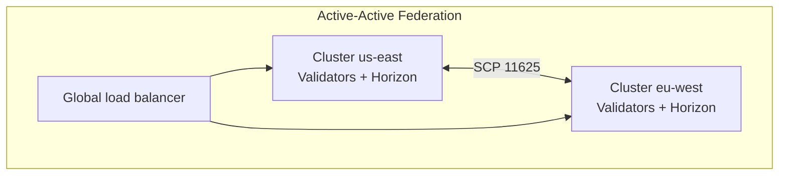
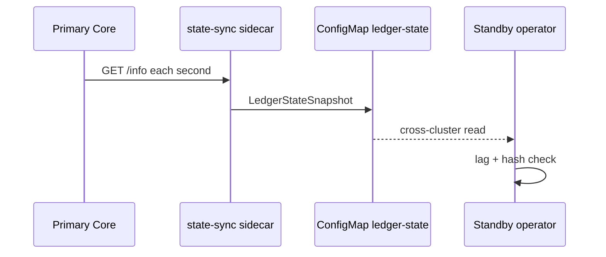

# Multi-Region Deployment and Failover

Architecture and operational procedures for running Stellar-K8s across **multiple regions** or clusters: supported patterns, traffic and data flow, failure detection, failover, failback, and validation.

**Related:** [Multi-cluster guide](multi-cluster.md) · [DR failover](dr-failover.md) · [Cross-cloud Horizon failover](cross-cloud-failover.md) · [Deployment pattern summary](deployment-patterns/multi-region-dr.md) · [Peer discovery](peer-discovery.md) · [Volume snapshots](volume-snapshots.md)

---

## Navigation

| Section | Topic |
|---------|--------|
| [1. Supported architectures](#1-supported-architectures) | Active-active, active-passive, hub-spoke |
| [2. Region responsibilities](#2-region-responsibilities) | Validators vs RPC |
| [3. Data and control flow](#3-data-and-control-flow) | SCP, DR sync, DNS |
| [4. Kubernetes configuration](#4-kubernetes-configuration) | CRD, Helm, bridges |
| [5. Failure scenarios](#5-failure-scenarios) | What breaks and signals |
| [6. Failover procedure](#6-failover-procedure) | Automated and manual |
| [7. Failback and recovery](#7-failback-and-recovery) | Return to primary |
| [8. Post-failover validation](#8-post-failover-validation) | Checklists |
| [9. References](#9-references) | Code and manifests |

---

## 1. Supported architectures

Stellar-K8s documents three multi-cluster patterns in [multi-cluster.md](multi-cluster.md). Choose based on cost, RTO/RPO, and quorum design.



| Pattern | Traffic | Validators | Typical use |
|---------|---------|------------|-------------|
| **Active-active federation** | All clusters serve RPC | Quorum spans regions | Lowest RPC latency, higher cost |
| **Active-passive (hot standby)** | Primary only; standby warmed | Standby synced via DR | Cost-sensitive; RTO minutes |
| **Hub-and-spoke** | Spokes run nodes; hub runs operator/metrics | Per spoke | Centralized observability |

**Important:** Multi-region validator layouts must preserve **Stellar quorum safety** (intersection, no double-signing). See [deployment-patterns/validator-ha-topology.md](deployment-patterns/validator-ha-topology.md).

---

## 2. Region responsibilities

| Region role | Workloads | Notes |
|-------------|-----------|-------|
| **Primary** | Quorum majority validators, primary Horizon, operator | Serves production traffic |
| **Secondary / standby** | Standby validators, optional Horizon replica | DR target; may receive no public traffic |
| **Witness / tertiary** | Light validators or observers | Optional; quorum latency optimization |

Annotations used in multi-cluster examples ([multi-cluster.md](multi-cluster.md)):

```yaml
metadata:
  annotations:
    stellar.org/cluster-role: "primary"
    stellar.org/cluster-name: "us-east"
```

---

## 3. Data and control flow

### Validator plane (SCP)

- Peers exchange SCP on **TCP 11625** (see [networking/index.md](networking/index.md)).
- Cross-region links should minimize RTT; the quorum optimizer tracks `stellar_quorum_consensus_latency_ms` ([quorum-optimization.md](quorum-optimization.md)).

### DR state sync (active-passive)

When `spec.drConfig` is enabled, the operator coordinates hot-standby behavior ([dr-failover.md](dr-failover.md)):



Sync strategies (authoritative Rust enum in [`src/crd/types.rs`](../src/crd/types.rs)):

| `syncStrategy` | Behavior |
|----------------|----------|
| `consensus` | Default DR alignment via consensus metadata |
| `peertracking` | Peer health-driven standby tracking |
| `archivesync` | History archive based catch-up |
| `streamingledger` | Continuous ledger stream via state-sync sidecar |

### Horizon plane

- **DNS / GLB failover** shifts clients to standby Horizon ([cross-cloud-failover.md](cross-cloud-failover.md), `spec.crossCloudFailover`).
- PostgreSQL may use logical replication or CloudNativePG cross-cluster replicas (`databaseSync` in cross-cloud config).

---

## 4. Kubernetes configuration

### Install operator per cluster

```bash
kubectl config use-context cluster-a
helm install stellar-operator ./charts/stellar-operator \
  --namespace stellar-system --create-namespace \
  --set clusterName=us-east

kubectl config use-context cluster-b
helm install stellar-operator ./charts/stellar-operator \
  --namespace stellar-system --create-namespace \
  --set clusterName=eu-west
```

### Enable cross-region DR (Helm)

From [dr-failover.md](dr-failover.md):

```yaml
featureFlags:
  enableDr: "true"

crossRegion:
  enabled: true
  peerClusters:
    - clusterId: "us-east-1"
      endpoint: "k8s-api.us-east-1.example.com"
      region: "us-east-1"
      port: 11625
      enabled: true
    - clusterId: "eu-west-1"
      endpoint: "k8s-api.eu-west-1.example.com"
      region: "eu-west-1"
      port: 11625
      enabled: true
```

### StellarNode DR spec (primary)

```yaml
apiVersion: stellar.org/v1alpha1
kind: StellarNode
metadata:
  name: validator-primary
  namespace: stellar-system
spec:
  nodeType: Validator
  network: Mainnet
  drConfig:
    enabled: true
    role: primary
    peerClusterId: "eu-west-1"
    syncStrategy: streamingledger
    healthCheckInterval: 30
    failoverDns:
      hostname: "horizon.stellar.example.com"
      provider: "route53"
```

Standby uses `role: standby` and the matching `peerClusterId`. CRD field reference: [`config/crd/stellarnode-crd.yaml`](../config/crd/stellarnode-crd.yaml) (`drConfig`).

### Cross-cluster networking

| Option | When to use |
|--------|-------------|
| `spec.crossCluster` + Submariner / Cilium mesh | Production isolated networks |
| ExternalName bridge Services | Lab / simple DNS bridging ([dr-failover.md](dr-failover.md)) |
| Submariner / BGP peering | See [peer-discovery.md](peer-discovery.md) |

List bridge services:

```bash
kubectl get services -n stellar-system -l stellar.org/component=cross-region-bridge
```

---

## 5. Failure scenarios

| Scenario | Detection | First response |
|----------|-----------|----------------|
| Primary region API server down | `kubectl` context errors; operator `Ready=False` | Execute [failover](#6-failover-procedure) |
| Validator quorum lost in primary | SCP metrics; topology `stalled_nodes` | Promote standby validators per runbook |
| Horizon primary unhealthy | GLB health check `/health` fails; `crossCloudFailover` | DNS/GLB shift to secondary |
| Sync lag > threshold | `status.drStatus.lagLedgers` | Pause failover; fix bridge or network |
| Fork detected | `status.drStatus.forkDetected: true` | Re-bootstrap standby from snapshot — do not fail over |

Lag guidance ([dr-failover.md](dr-failover.md)):

| Lag (ledgers) | Status |
|---------------|--------|
| 0–10 | In sync |
| 11–50 | Degraded — investigate |
| > 500 | Out of sync — re-bootstrap |

---

## 6. Failover procedure

### Prerequisites checklist

- [ ] Standby `kubectl` context works
- [ ] `kubectl get stellarnode -A` shows `Ready=True` on standby validators
- [ ] `status.drStatus` shows `forkDetected: false` and acceptable `lagLedgers`
- [ ] Velero/snapshot backups available if restore required ([volume-snapshots.md](volume-snapshots.md))
- [ ] DNS TTL ≤ 300s for Horizon hostname

### Automated failover (operator DR controller)

When primary is unreachable longer than `healthCheckInterval` (default 30s):

```bash
kubectl get stellarnode validator-standby \
  -n stellar-system --context=standby \
  -w -o jsonpath='{.status.drStatus.failoverActive}'
```

Implementation: [`src/controller/dr.rs`](../src/controller/dr.rs).

### Manual failover (controlled)

1. **Quiesce primary validators**

   ```bash
   kubectl patch stellarnode validator-primary \
     -n stellar-system --context=primary \
     -p '{"spec":{"replicas":0}}'
   ```

2. **Confirm standby ledger alignment**

   ```bash
   kubectl get stellarnode validator-standby \
     -n stellar-system --context=standby \
     -o jsonpath='{.status.ledgerSequence}{"\n"}'
   ```

3. **Promote standby**

   ```bash
   kubectl patch stellarnode validator-standby \
     -n stellar-system --context=standby \
     -p '{"spec":{"drConfig":{"role":"primary"}}}'
   ```

4. **Failover Horizon DNS** (provider-specific; example AWS CLI in [dr-failover.md](dr-failover.md))

5. Run [validation](#8-post-failover-validation)

### DR drills

Schedule non-destructive drills via `spec.drConfig.drillSchedule` (cron, `dryRun`, `autoRollback`). See CRD `drillSchedule` in [`config/crd/stellarnode-crd.yaml`](../config/crd/stellarnode-crd.yaml).

---

## 7. Failback and recovery

After primary region is healthy:

1. Re-sync primary validators from snapshots or archives if needed.
2. Demote former standby: `drConfig.role: standby`.
3. Restore DNS/GLB weights to primary (or enable `autoFailback` where configured in `crossCloudFailover`).
4. Run consistency tests: `cargo test state_sync -- --nocapture` ([dr-failover.md](dr-failover.md)).

Rollback within 15 minutes of a bad failover: follow **Part 4: Rollback Procedure** in [dr-failover.md](dr-failover.md).

---

## 8. Post-failover validation

| Check | Command / endpoint | Pass criteria |
|-------|-------------------|---------------|
| Validator Ready | `kubectl get stellarnode -A` | All critical nodes `Ready=True` |
| Horizon health | `curl -fsS https://<horizon-host>/health` | HTTP 200, `core_synced: true` |
| Ledger advancing | `kubectl get stellarnode <name> -o jsonpath='{.status.ledgerSequence}'` | Sequence increases over 30s |
| SCP topology | `curl http://localhost:9090/api/v1/quorum/topology` (via port-forward) | `healthy: true`, no stalled nodes |
| Transaction path | Submit test tx on target network | Included in next ledger |

---

## 9. References

| Topic | Location |
|-------|----------|
| DR controller | [`src/controller/dr.rs`](../src/controller/dr.rs) |
| State sync sidecar | [`src/controller/state_sync.rs`](../src/controller/state_sync.rs) |
| Cross-cluster bridges | [`src/controller/cross_cluster.rs`](../src/controller/cross_cluster.rs) |
| E2E DR tests | [`tests/dr_failover_e2e.rs`](../tests/dr_failover_e2e.rs) |
| Short DR pattern doc | [deployment-patterns/multi-region-dr.md](deployment-patterns/multi-region-dr.md) |

---

**Last updated:** 2026-07-27
