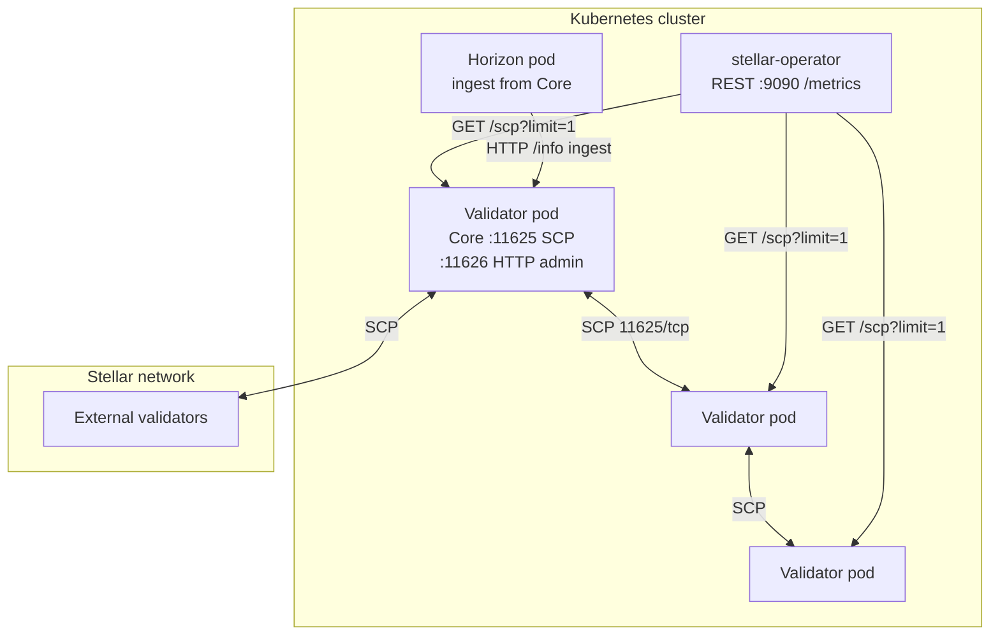
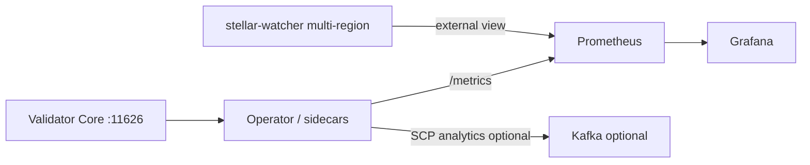

# SCP Consensus Topology and Monitoring

Comprehensive operator guide for **Stellar Consensus Protocol (SCP)** topology, quorum relationships, and monitoring in Stellar-K8s deployments.

**Related docs:** [SCP Topology Dashboard](scp-topology-dashboard.md) · [Quorum Optimization](quorum-optimization.md) · [Byzantine Monitoring](byzantine-monitoring.md) · [SCP Analytics Pipeline](scp-analytics-pipeline.md) · [Stellar Metrics Guide](metrics/STELLAR_METRICS_GUIDE.md)

---

## Navigation

| Section | Topic |
|---------|--------|
| [1. SCP topology in this platform](#1-scp-topology-in-this-platform) | Validators, roles, and data flow |
| [2. Quorum and node relationships](#2-quorum-and-node-relationships) | Quorum sets, thresholds, critical nodes |
| [3. Kubernetes resources](#3-kubernetes-resources) | CRDs, labels, ports, Helm flags |
| [4. Monitoring architecture](#4-monitoring-architecture) | Metrics, dashboards, alerts |
| [5. Operator topology API](#5-operator-topology-api) | REST/WebSocket quorum graph |
| [6. Operational procedures](#6-operational-procedures) | Health checks, troubleshooting |
| [7. Code and configuration references](#7-code-and-configuration-references) | Repository paths |

---

## 1. SCP topology in this platform

Stellar-K8s runs **Validator** `StellarNode` workloads as StatefulSets. Each validator participates in SCP on the Stellar network using a configured quorum set. Horizon and Soroban RPC nodes **do not** participate in SCP; they ingest ledger data from Stellar Core.



### Node roles

| Role | `spec.nodeType` | SCP participant | Primary ports |
|------|-----------------|-----------------|---------------|
| Validator | `Validator` | Yes | `11625` (SCP peers), `11626` (HTTP admin) |
| Horizon | `Horizon` | No | Horizon HTTP (typically `8000` in examples) |
| Soroban RPC | `SorobanRPC` | No | RPC HTTP |

Peer discovery and explicit `spec.validatorConfig` peers are documented in [peer-discovery.md](peer-discovery.md). Only **Validator** nodes are included in automatic peer-discovery output.

---

## 2. Quorum and node relationships

### Quorum set basics

Each validator declares a **quorum set**: trusted validators, nested slices, and a **threshold** (minimum agreeing nodes). SCP advances through phases (`PREPARE` → `CONFIRM` → `EXTERNALIZE`) until the network externalizes a ledger.

Configure quorum in the `StellarNode` CRD:

```yaml
spec:
  nodeType: Validator
  validatorConfig:
    seedSecretRef: my-validator-seed
    quorumSet:
      threshold: 2
      validators:
        - "GCEZWKCA5VLDNRLN3RPRJMRZOX3Z6G5CHCGBWRXSJHEG8VORHEA3PUO"
        - "GB3PLI6G5K5L3K3K3K3K3K3K3K3K3K3K3K3K3K3K3K3K3K3K3K3K3K3K3K"
```

See [api-reference.md](api-reference.md) for the full `validatorConfig.quorumSet` schema.

### Automated quorum optimization

The operator can analyze peer RTT and availability and suggest or apply quorum changes. See [quorum-optimization.md](quorum-optimization.md).

| `quorumOptimization.mode` | Behavior |
|---------------------------|----------|
| `Manual` | Emits Kubernetes Events with recommendations only |
| `Auto` | Patches `spec.validatorConfig.quorumSet` when health improves |

### Critical nodes and fragility

The topology engine marks validators whose removal would break **quorum intersection** as **critical**. Prometheus exposes:

- `stellar_quorum_fragility_score` — higher values indicate a more fragile configuration
- `stellar_quorum_critical_nodes` — count of critical validators
- `stellar_quorum_min_overlap` — minimum overlap between quorum sets
- `stellar_quorum_consensus_latency_ms` — consensus latency used by the scheduler proximity optimizer

Implementation: [`src/controller/quorum/`](../src/controller/quorum/) and [`src/controller/metrics.rs`](../src/controller/metrics.rs).

---

## 3. Kubernetes resources

### Labels used for topology collection

The operator lists Validator pods with:

```text
app.kubernetes.io/name=stellar-node,stellar.org/node-type=Validator
```

Ensure your Helm release or manifests set these labels (default in the project charts).

### Stellar Core HTTP admin API

Topology polling uses:

```text
GET http://{pod_ip}:11626/scp?limit=1
```

No extra Core configuration is required when the admin port is reachable from the operator pod. Network policies must allow operator → validator on **11626/TCP**. SCP peer traffic uses **11625/TCP** (see [troubleshooting/networking.md](troubleshooting/networking.md)).

### Helm feature flag

Prioritize topology collection via ConfigMap or Helm:

```yaml
# charts/stellar-operator values
featureFlags:
  enableScpTopology: "true"
```

```yaml
apiVersion: v1
kind: ConfigMap
metadata:
  name: stellar-operator-config
  namespace: stellar-system
data:
  enable_scp_topology: "true"
```

---

## 4. Monitoring architecture



### Layered observability

| Layer | Purpose | Documentation |
|-------|---------|----------------|
| **In-cluster SCP metrics** | Phase timing, quorum failures | [STELLAR_METRICS_GUIDE.md — SCP Metrics](metrics/STELLAR_METRICS_GUIDE.md#scp-metrics) |
| **Live quorum graph** | Phase, stalls, critical nodes | [scp-topology-dashboard.md](scp-topology-dashboard.md) |
| **SCP message streaming** | Deep message-level analysis | [scp-analytics-pipeline.md](scp-analytics-pipeline.md) |
| **External Byzantine view** | Partition detection across regions | [byzantine-monitoring.md](byzantine-monitoring.md) |

### Key SCP Prometheus metrics

| Metric | Type | When to alert |
|--------|------|----------------|
| `stellar_scp_quorum_intersection_failures` | Counter | Any increase — critical |
| `stellar_scp_externalize_time_seconds` | Histogram | p99 sustained high vs baseline |
| `stellar_ledger_close_time_p99` | Gauge | Ledger close degradation |
| `stellar_quorum_fragility_score` | Gauge | Trending up after topology changes |

Example PromQL (p99 total SCP time):

```promql
histogram_quantile(0.99,
  rate(stellar_scp_nomination_time_seconds_bucket[5m]) +
  rate(stellar_scp_ballot_prepare_time_seconds_bucket[5m]) +
  rate(stellar_scp_ballot_commit_time_seconds_bucket[5m]) +
  rate(stellar_scp_externalize_time_seconds_bucket[5m])
)
```

Grafana dashboard JSON: [monitoring/grafana-validator-dashboard.json](../monitoring/grafana-validator-dashboard.json) (see [GRAFANA_DASHBOARD_GUIDE.md](monitoring/GRAFANA_DASHBOARD_GUIDE.md)).

### Health indicators

| Signal | Healthy | Investigate |
|--------|---------|-------------|
| Validator `Ready` condition | `True` | `Syncing` / `Creating` — see [health-checks.md](health-checks.md) |
| Topology `healthy` field | `true` | All pod SCP queries failed |
| Stalled nodes in topology | Empty list | Red-bordered nodes in dashboard |
| `stellar_watcher:divergence_ratio` | `< 0.20` | Possible partition — [byzantine-monitoring.md](byzantine-monitoring.md) |

---

## 5. Operator topology API

When the operator REST API is enabled (`operator.restApiEnabled: true`, port **9090**):

| Method | Path | Description |
|--------|------|-------------|
| `GET` | `/api/v1/quorum/topology` | JSON snapshot |
| `GET` | `/api/v1/quorum/topology/stream` | WebSocket; updates every 5s |

### Procedure: snapshot from a workstation

```bash
kubectl port-forward -n stellar-system svc/stellar-operator 9090:9090
```

```bash
curl -sS http://localhost:9090/api/v1/quorum/topology | jq '.healthy, .stalled_nodes, (.nodes | length)'
```

WebSocket (requires `wscat`):

```bash
wscat -c ws://localhost:9090/api/v1/quorum/topology/stream
```

Response schema and UI behavior: [scp-topology-dashboard.md](scp-topology-dashboard.md#response-schema).

Implementation: [`src/rest_api/scp_topology.rs`](../src/rest_api/scp_topology.rs).

---

## 6. Operational procedures

### Daily SCP health review

1. Open the operator dashboard **SCP Topology** tab or call `/api/v1/quorum/topology`.
2. Confirm no stalled validators and `healthy: true`.
3. In Grafana, check `stellar_scp_quorum_intersection_failures` and ledger close p99.
4. If Byzantine watchers are deployed, confirm `stellar:watcher:divergence_ratio < 0.20`.

### Validator not externalizing

1. Check Core logs: `kubectl logs -n <ns> <validator-pod> -c stellar-core`.
2. Query admin API from a debug pod:

   ```bash
   kubectl run -it --rm curl --image=curlimages/curl --restart=Never -- \
     curl -sS "http://<pod-ip>:11626/info"
   ```

3. Verify SCP peer connectivity on **11625** ([networking troubleshooting](troubleshooting/networking.md)).
4. Review quorum set changes in recent Events: `kubectl get events --field-selector involvedObject.kind=StellarNode`.

### After quorum set changes

1. Watch topology for critical-node warnings.
2. Run `stellar_quorum_fragility_score` before/after comparison.
3. If using `quorumOptimization.mode: Manual`, apply suggested changes explicitly.

### Enable SCP analytics (optional)

Follow [scp-analytics-pipeline.md](scp-analytics-pipeline.md) to stream SCP messages to Kafka for offline analysis.

---

## 7. Code and configuration references

| Component | Path |
|-----------|------|
| Topology HTTP/WebSocket handlers | [`src/rest_api/scp_topology.rs`](../src/rest_api/scp_topology.rs) |
| SCP client and graph analysis | [`src/controller/quorum/`](../src/controller/quorum/) |
| Prometheus quorum metrics | [`src/controller/metrics.rs`](../src/controller/metrics.rs) |
| `StellarNode` CRD | [`config/crd/stellarnode-crd.yaml`](../config/crd/stellarnode-crd.yaml) |
| Validator example | [`examples/`](../examples/) (search for `nodeType: Validator`) |
| Chaos: peer partition test | [`tests/chaos/04-validator-peer-partition.yaml`](../tests/chaos/04-validator-peer-partition.yaml) |

---

**Last updated:** 2026-07-27
